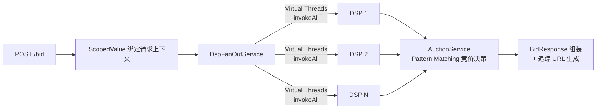

# Bolt


基于 JDK 25 构建的轻量级 RTB（Real-Time Bidding）广告竞价引擎，以真实竞价场景为载体，实践 Virtual Threads、ScopedValue、Sealed Types 等现代 Java 特性。

## 核心亮点

| 模块 | 实现 | JDK 25 特性 |
|------|------|-------------|
| 并发扇出 | 每请求 VT Executor + invokeAll 统一超时 | Virtual Threads |
| 请求上下文 | ScopedValue 替代 ThreadLocal | ScopedValue |
| DSP 响应建模 | Sealed Interface (Success/NoBid/Timeout/Error) | Sealed Types + Record |
| 竞价决策 | switch 表达式 + 类型模式匹配 | Pattern Matching |
| 配置中心 | Redis 存储 + Caffeine 本地缓存 + Pub/Sub 实时失效 | — |
| 追踪埋点 | AES 加密参数 + 时间戳防重放 | — |

## 架构



## 快速启动

### Docker（推荐）

```bash
git clone https://github.com/zK0G0w/Bolt.git
cd Bolt
docker compose up -d
```

应用启动后访问 `http://localhost:9292`，发起竞价请求：

```bash
curl -X POST http://localhost:9292/bid \
  -H "Content-Type: application/json" \
  -d @examples/sample-bid-request.json
```

### 本地开发

前置依赖：JDK 25、Redis 7.x

```bash
./mvnw spring-boot:run -Dspring-boot.run.profiles=dev

curl -X POST http://localhost:9292/bid \
  -H "Content-Type: application/json" \
  -d @examples/sample-bid-request.json
```

模拟配置热更新：

```bash
redis-cli -a redis123456 -n 10 PUBLISH bolt:cache:invalidate \
  '{"entity":"dsp","id":"plat-001","action":"update"}'
```

## 性能基准

测试环境：MacBook Pro M3 Max / 64GB RAM / JDK 25 / Redis 7.x

测试工具：[hey](https://github.com/rakyll/hey)，MockDspClient 模拟 30-120ms 随机延迟

| 并发连接 | QPS | p50 | p99 | 说明 |
|---------|-----|-----|-----|------|
| 200 | 2,127 | 97ms | 123ms | 轻负载 |
| 1000 | **10,260** | 100ms | 140ms | Virtual Threads 线性扩展 |

> 响应时间几乎不随并发数增长（稳定 ~100ms），QPS 与并发数呈线性关系——没有线程池上限，并发从 200 扩到 1000，延迟不退化，吞吐翻 5 倍。

## 项目目标

以真实 RTB 场景为载体，实践 JDK 25 的现代语言特性与并发模型，对比传统线程池方案在代码复杂度和资源消耗上的差异。

## License

[MIT](LICENSE)
